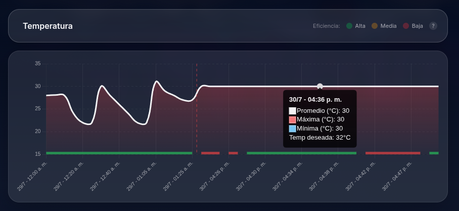
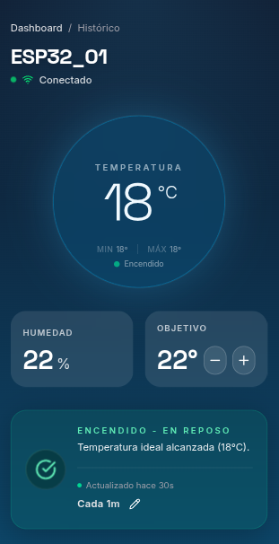
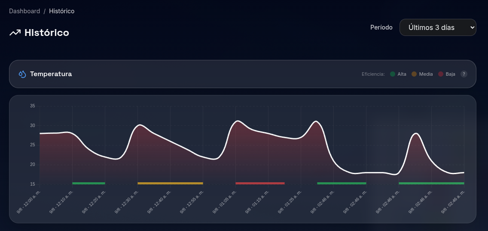
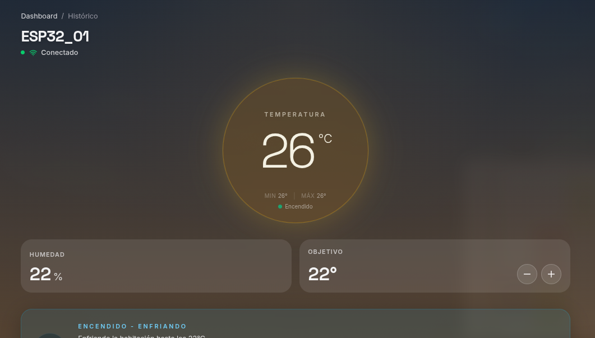
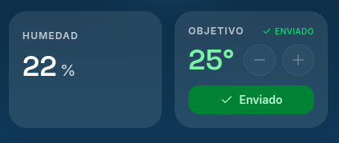

# Runtime Terror — Sistema de Monitoreo y Control de Climatización IoT

**Universidad Nacional de Córdoba** · FCEFyN · Ingeniería de Software 2026

Sistema IoT de punta a punta que permite monitorear y controlar un aire acondicionado de forma remota. Un **ESP32** con sensor **DHT11** publica lecturas de temperatura y humedad vía **MQTT**, un backend **NestJS** las procesa y persiste en **PostgreSQL**, y un dashboard **Next.js** las visualiza en tiempo real.

<p align="center">
  
  <br>
  <em>Dashboard histórico — temperatura, humedad y eficiencia en tiempo real</em>
</p>

<p align="center">
  
  <br>
  <em>Vista responsive desde dispositivo móvil</em>
</p>

<p align="center">
  <video src="docs/media/iot_walkthrough.mp4" controls width="700">
    Tu navegador no soporta video HTML5.
    <a href="docs/media/iot_walkthrough.mp4">Descargar video</a>
  </video>
  <br>
  <em>Recorrido completo por el sistema</em>
</p>

## Stack

```
ESP32 (DHT11 + MQTT) → NestJS + PostgreSQL → Next.js Dashboard
```

| Capa            | Tecnología                                                     |
| --------------- | -------------------------------------------------------------- |
| Firmware        | PlatformIO (Arduino framework, DHT11, PubSubClient)            |
| Backend         | NestJS 11, TypeORM, PostgreSQL, MQTT microservice, Swagger     |
| Frontend        | Next.js 16 (App Router), shadcn/ui, Recharts, Chart.js, Vitest |
| Infraestructura | Docker (postgres:16-alpine + eclipse-mosquitto:2)              |

## Demo rápida

```bash
cp .env.example .env                          # configuración única
cd docker && docker compose up -d              # PostgreSQL :5433 + MQTT :1883
cd backend/nestjs && npm install && npm run dev
cd frontend/dashboard && npm install && npm run dev
```

Luego abrí http://localhost:3000/api (Swagger) y http://localhost:3001 (Dashboard).

## Galería

<p align="center">
  
  <br>
  
  <br>
  
  <br>
  <em>Capturas adicionales del sistema</em>
</p>

## Estructura del proyecto

```
firmware/esp32/       Código del ESP32 (sensores, MQTT, lógica de control)
backend/nestjs/       API REST + microservicio MQTT (NestJS)
frontend/dashboard/   Panel web (Next.js)
docker/               docker-compose.yml con PostgreSQL y Mosquitto
docs/                 Documentación
  ├── media/          Imágenes, capturas y grabaciones
  ├── setup.md        Guía de instalación completa
  ├── payload.md      Especificación de la API REST y payloads MQTT
  ├── topics.md       Mapa de topics MQTT
  ├── architecture.md Diagrama y descripción de la arquitectura
  ├── hardware_documentation.md  Cableado y pines del ESP32
  ├── domain_logic.md Lógica de dominio, estrategias y patrones
  ├── git_workflow.md Flujo de trabajo Git
  └── commit_convention.md  Formato de commits
```

## Documentación

| Documento                                                        | Descripción                     |
| ---------------------------------------------------------------- | ------------------------------- |
| [ABOUT.md](ABOUT.md)                                             | Contexto académico y del equipo |
| [docs/setup.md](docs/setup.md)                                   | Guía de instalación detallada   |
| [docs/architecture.md](docs/architecture.md)                     | Arquitectura del sistema        |
| [docs/payload.md](docs/payload.md)                               | API REST y payloads MQTT        |
| [docs/topics.md](docs/topics.md)                                 | Topics MQTT                     |
| [docs/hardware_documentation.md](docs/hardware_documentation.md) | Hardware del ESP32              |
| [docs/domain_logic.md](docs/domain_logic.md)                     | Lógica de dominio               |
| [docs/git_workflow.md](docs/git_workflow.md)                     | Flujo Git                       |
| [docs/commit_convention.md](docs/commit_convention.md)           | Formato de commits              |
| [docs/CONSIGNA.md](docs/CONSIGNA.md)                             | Consigna original de la materia |

## Licencia

Proyecto académico — Universidad Nacional de Córdoba
